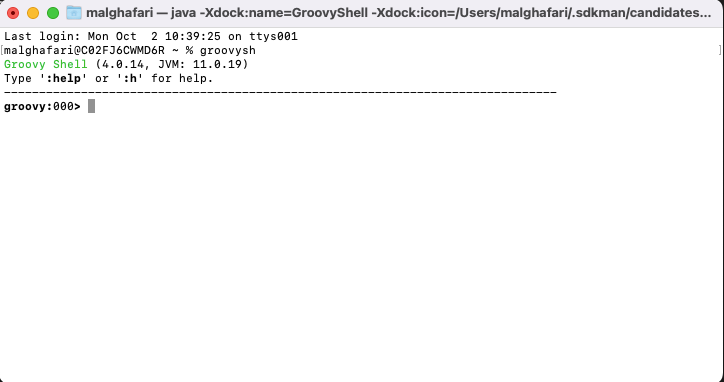
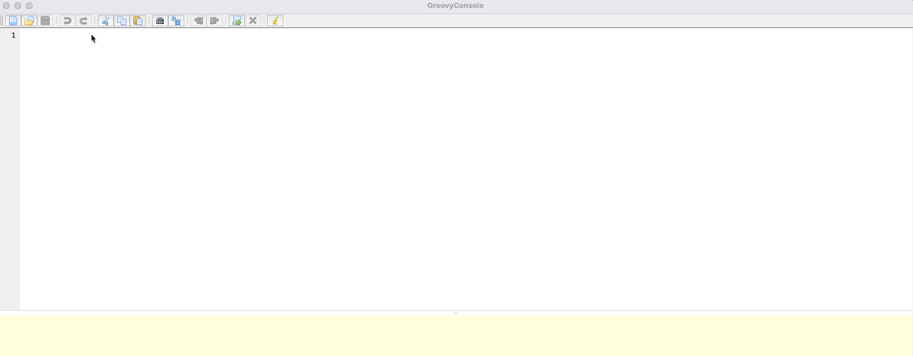

# Groovy
 There are 2 editors that come with groovy by default 
 - GroovyShell : run ```groovysh ``` 
 
 - GroovyConsole: run ```groovyConsole```  
 


### HelloWorld in groovy 
- System.out is auto imported , so you can do println withou System.out 
- semi-colon at the end is optionl for the most part 
- parentheses are not required most of the time 

```groovy
println 'Welcome To Groovy'
``` 
### The assert statement 
assert can be used in test cases instead of junit or assertJ assertions , it gives a nice graph of details if the statment is false 

```
int x = 3
int y = 4
assert 7 == x + y + 1 
```

``` 
Exception thrown

Assertion failed: 

assert 7 == x + y + 1
         |  | | | |
         |  3 7 4 8
         false

	at ConsoleScript61.run(ConsoleScript61:3)
```
### Automactic imports 
In groovy, the below imports are added by groovy 
```
import java.lang.*
import java.util.*
import java.io.*
import java.net.*
import groovy.lang.*
import groovy.util.*
import java.math.BigInteger
import java.math.BigDecimal
```
This is done because the classes from these packages are most commonly used. By importing these boilerplate code is reduced.

### The def keyword 
Groovy is optionally typed, if you declare a variable of type String or Date or Employee , then you can't assign another type  

```
int x = 3 
x = 'abc' 
 
Exception thrown

org.codehaus.groovy.runtime.typehandling.GroovyCastException: Cannot cast object 'abc' with class 'java.lang.String' to class 'int'
	at ConsoleScript62.run(ConsoleScript62:2)

```
def can be used to create untyped variable , the type will be determined at runtime 
```
def x = 1 
println x.getClass() 
x = 'abc' 
println x.getClass() 
 
class java.lang.Integer
class java.lang.String
```
### Integer and Floating point types 
- No primitives (all are wrapper classes)
- floating values uses BigDecimal by default 
```
println 3.getClass() 
println 777777777777777.getClass() 
println 88888888887878788788788788787878.getClass() 
println 0.5.getClass() 
 
class java.lang.Integer
class java.lang.Long
class java.math.BigInteger
class java.math.BigDecimal
```

### Operator Overloading 

